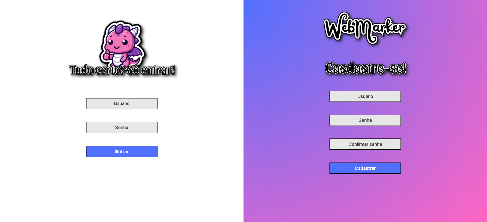
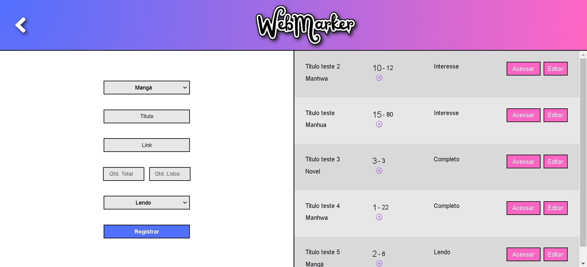
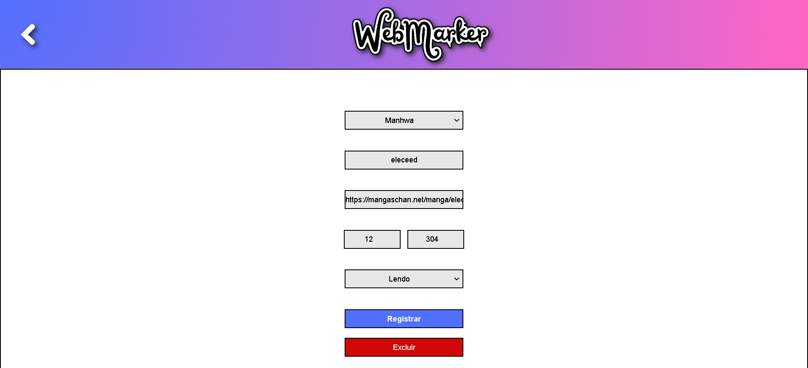

# WebMarker

O WebMarker é uma aplicação web projetada para facilitar a organização e o acompanhamento das suas leituras. Com esta ferramenta intuitiva, você pode registrar, editar e excluir facilmente informações sobre as obras que está lendo, mantendo-se sempre atualizado e organizado.

## NOVA VERSÃO 

## Tecnologias Utilizadas

* HTML e CSS: Estruturam e estilizam as páginas do aplicativo, garantindo uma interface visualmente atraente e responsiva.
* JavaScript: Responsável pela interatividade na interface do usuário, validação de formulários e atualizações dinâmicas de conteúdo.
* Java Spring Boot: Framework robusto para o desenvolvimento de APIs RESTful, facilitando a integração do back-end com o front-end do aplicativo.
* MySQL: Banco de dados relacional utilizado para armazenar e gerenciar os dados das leituras dos usuários de forma segura e eficiente.

## Funcionalidades em destaque

* Registro de Leituras: Adicione novos livros à sua lista de leitura com detalhes como título, link e progresso.
* Gerenciamento Flexível: Edite informações existentes conforme avança na leitura ou suas preferências mudam.
* Interface Amigável: Uma interface limpa e responsiva garante uma experiência agradável em qualquer dispositivo.
* Redicionamento: Adicionando o link da obra é possível ir, com um clique, até a página onde ela se encontra.

# Principais telas

## Login

A tela de Login e Cadastro oferece acesso seguro e conveniente à sua plataforma de organização de leituras. Com um design intuitivo e funcionalidades robustas de autenticação, você pode facilmente criar uma conta nova ou acessar a sua existente para começar a gerenciar suas leituras.

## Página principal

A tela principal do aplicativo combina um formulário intuitivo para adicionar novas leituras com uma lista clara e organizada das leituras existentes. Aqui, você pode registrar facilmente novos livros, atualizar seu progresso de leitura, acessar a sua obra e visualizar todas as suas entradas de maneira ordenada. Esta interface amigável facilita o gerenciamento e acompanhamento das suas leituras em um só lugar.

## Menu de edição

Na tela de Edição, você tem o controle total sobre as suas entradas de leitura. Edite detalhes como título e progresso e qualquer outra informação relevante conforme necessário. Esta tela garante flexibilidade e praticidade, permitindo ajustes precisos à medida que você avança nas suas leituras ou atualiza suas preferências.
